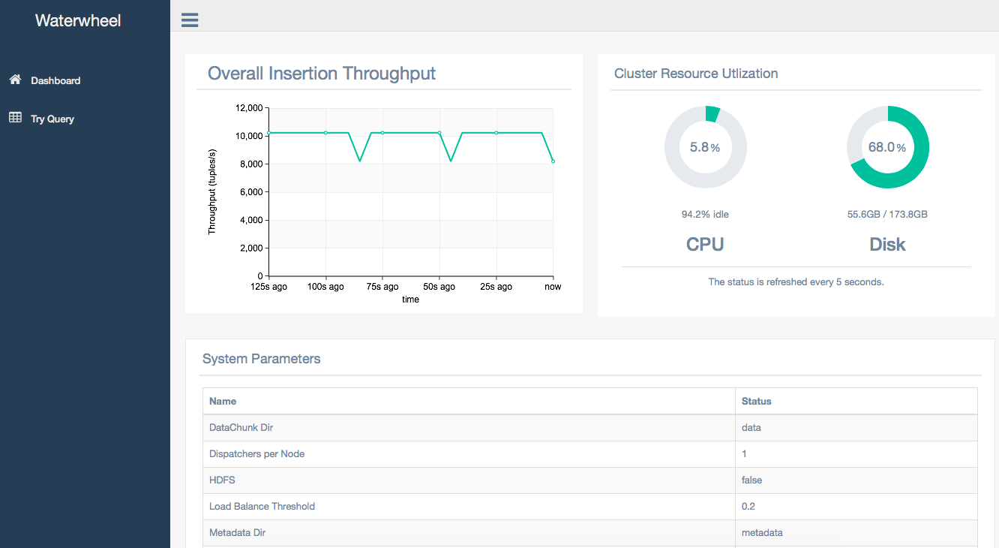

m# Waterwheel

Waterwheel is a distributed append-only store designed for high-throughput data ingestion and real-time temporal range queries. Waterwheel supports over 1 million insertions per seconds and millisecond queries simultaneously.

### Data & Query Model
Data tuples continuouly arrive at the system. 

A tuple consists of
- An indexing key;
- A timstamp;
- Any number of attributes;

We assume the timestamps of the tuples are roughly in increasing order. 

A user query contains:
- A key range constraint (e.g.,100 < key < 250)
- A temporal range constraint (e.g., last 5 minitues, or 9pm to 12pm yesterday)
- A user-defined predicate (optional, could be an arbitrary user-defined logic which determines if a tuple qulifies.)
- Aggregator (optional, e.g., group-by, sum, avg, min, max)
- Sortor (optional, sort on any combination of attributes in decreasing or increasing order)

### Requirement
1. JDK 8 or higher;
1. [maven](http://maven.apache.org);
1. [Apache Storm](https://github.com/apache/storm) (not needed in local mode);
1. [HDFS](https://hadoop.apache.org) (not needed in local mode);

### Quick Start
#### 1. Local mode
Running our system in local model is the easiest way to get a feeling of the system. Local model is typically used internally to debug the topology. If you want to use our system in production, we highly suggest you to run our system in cluster model to fully exploit the performance of the system.

To run our system in local mode, you should follow those steps:

1. Download the source codes

```
$ git clone https://github.com/ADSC-Cloud/Waterwheel
```

2. Compile the source codeF

 ```
 $ mvn clean install -DskipTests
 ```
 
3. Launch the system

Run the following command to launch the system

```
$ mvn exec:java -pl topology -Dexec.mainClass=indexingTopology.topology.kingbase.KingBaseTopology -Dexec.args="-m submit --local -f conf/conf.yaml"
```

4. Open a new terminal and run the following command to ingest tuples to the system:

```
$ mvn exec:java -pl topology -Dexec.mainClass=indexingTopology.topology.kingbase.KingBaseTopology -Dexec.args="-m ingest -r 10000 --ingest-server-ip localhost"
```


5. Deploy Web-UI daemon

```
$ mvn tomcat7:run -pl web
```
Now you can get access to the web ui via [http://localhost:8080](http://localhost:8080). 

It looks like this:



On the dashboard, you can see the instantenaous insertion throughput and the resource utilization, as well as a table showing system parameters.

6. Run queries

You can try to run some demo queries either on the web ui or via terminal commandline.

On the web ui, you can goto the query demo interface by clicking the ```Try Query``` bottom of the left of the dashboard. In the demo interface, you can specify the kay ranges and the temporal ranges and run the query by clicking the ```Query!``` bottom.

Or alternatively, you can open a new terminal and run the following command to issue generated queries:
```
$ mvn exec:java -pl topology -Dexec.mainClass=indexingTopology.topology.kingbase.KingBaseTopology -Dexec.args="-m query --query-server-ip localhost"
```
Use ```-h``` to print the detailed usage of the arguments.


#### 2. Cluster model

1. Deploy Apache Storm and make sure that the nimbus and supervisors are running properly.

2. Setup HDFS


3. Download the source codes

```
$ git clone https://github.com/ADSC-Cloud/Waterwheel
```

4. Make sure that ```<scope>provided</scope>``` is uncommented in pom.xml file.

5. Change the configures in config/TopologyConfig accordingly.

set ```HDFSFlag = true``` to use HDFS as the storage system.

Create a folder for the system in HDFS and set ```dataDir``` in the config file properly. Make sure that the folder is writable.

6. Compile the source code

```bash
$ mvn clean install -DskipTests
```

8. Launch Apache Storm's nimbus and supervisors properly. 

9. Submit the topology to Apache Storm

```
$ storm jar SOURCE_CODE_PATH/target/IndexingTopology-1.0-SNAPSHOT.jar indexingTopologyNormalDistributionTopology append-only-store
```

#### Acknowledgement

This work was partially supported by SingAREN/AWS Cloud Credit for Research Program 2016.
